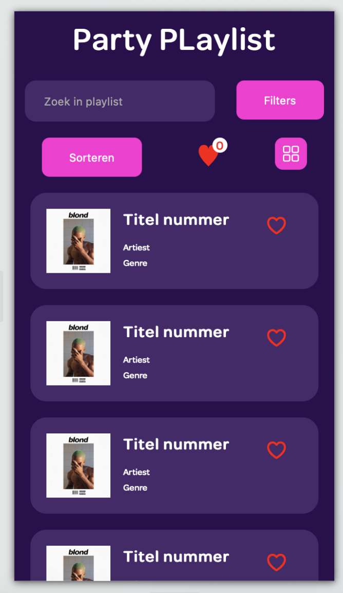
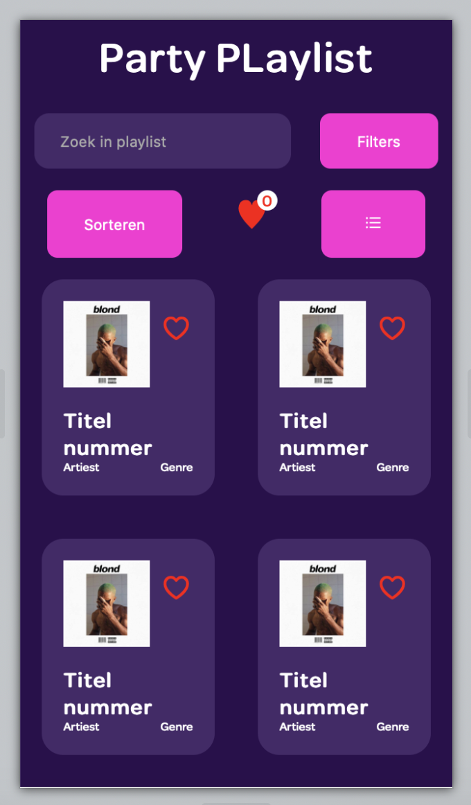
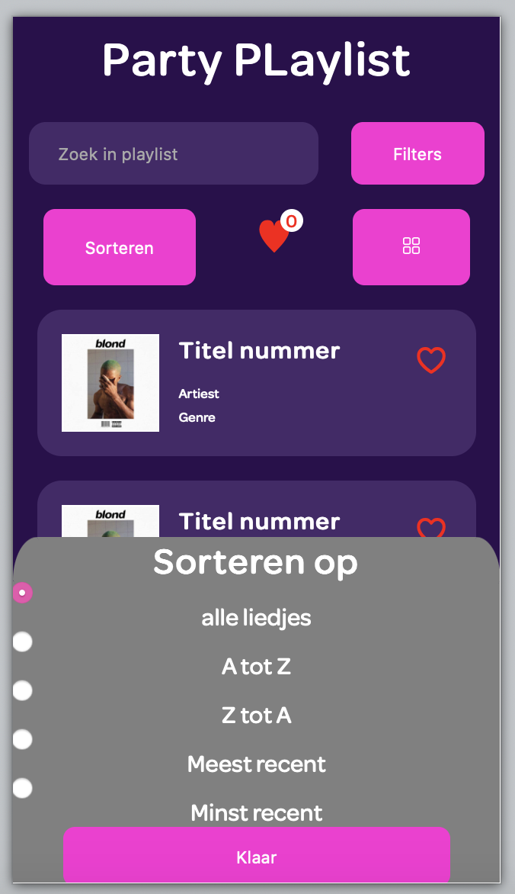
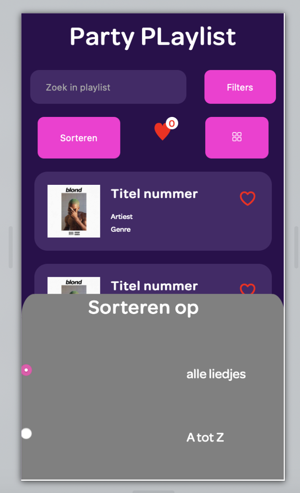
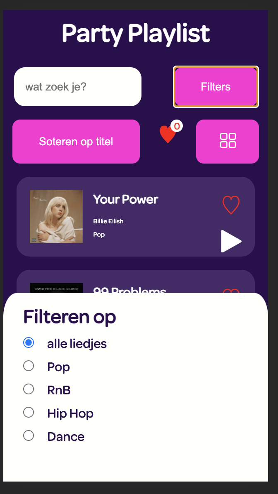
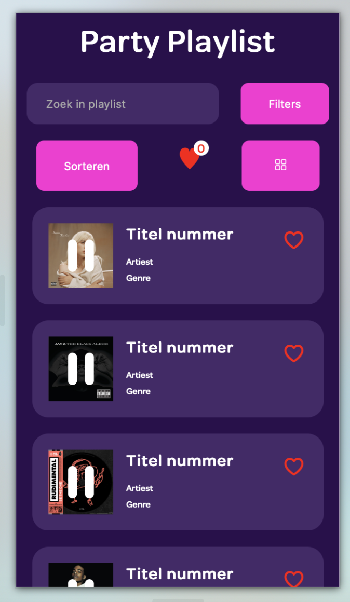
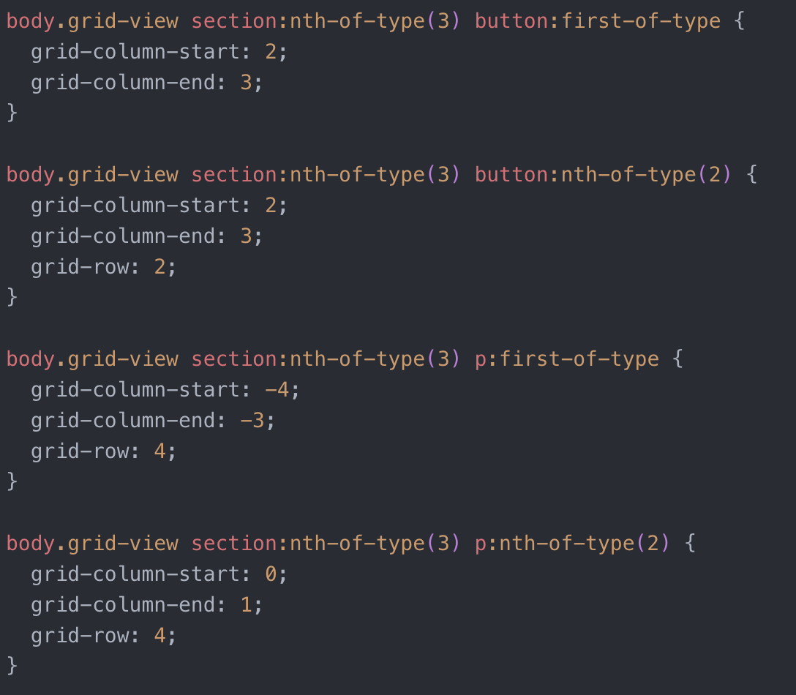

# Procesverslag
**Auteur:** -Dionne Budding-

**Het werk:** [opdracht 1](opdracht1/index.html) en [opdracht 2](opdracht2/index.html)

Markdown cheat cheet: [Hulp bij het schrijven van Markdown](https://github.com/adam-p/markdown-here/wiki/Markdown-Cheatsheet). Nb. de standaardstructuur en de spartaanse opmaak zijn helemaal prima. Het gaat om de inhoud van je procesverslag. Besteedt de tijd voor pracht en praal aan je website.

## Bronnenlijst
1. -Split screen: https://www.w3schools.com/howto/tryit.asp?filename=tryhow_css_split_screen-
2. -https://www.onlinewebfonts.com-
3. -https://codepen.io/shooft/pen/bGgvdZZ-
4. -https://stackoverflow.com/questions/37751375/instagram-new-logo-css-background-
5. -https://youtu.be/6AdMP_MGXvE-
6. -https://codepen.io/twinpixxx/pen/PKEGdV-

## Je 'posts' (je code-dagboek)

Je procesverslag is een soort dagboek.
Bij elk voortgangsgesprek en het eindgesprek voeg je een ‘post’ aan je dagboek toe.

In zo’n ‘post’ neem je op:
- Wat je van plan was
- Je werk zo ver
- Wat er goed ging
- Wat er lastig is
- Wat je plannen zijn

1e voortgangsgesprek:
- Dit was ik van plan: Twee concepten uitwerken en beginnen aan m'n code.
- Je werk zo ver: De eerste twee weken heb ik vooral de opdrachten gemaakt voor FvD en filmpjes en artikelen gelezen over de stof van dit vak. Op deze manier heb ik een goede basis om te beginnen aan de eerste opdracht.  
- Wat er goed ging: De opdrachten gingen vrij oke met af en toe spieken naar het antwoord. Ik merkte dat ik het best wel snel weer oppakte, dit had ik niet gedacht.
- Wat er lastig is: Ik vond het lastig om de opdrachten zelfstandig te maken en zelf op bepaalde dingen te komen. Als ik dan naar de uitwerkingen keek dacht ik al snel 'oh ja'.
- Wat je plannen zijn: Verder gaan aan de code voor opdracht 1.

- wat ik wil bespreken: 1. Op google chrome zit het logo er anders uit dan op safari.
                        2. Responsive
                        3. Voor het skateboard moet ik heel specifiek op hoveren, kan dit net zoals het logo wat breder?
                        4. Letters van instagram niet aan elkaar?

2e voortgangsgesprek:
- Dit was ik van plan: Beginnen aan mijn eerste animatie en hier zo ver mogelijk mee komen, zodat ik gerichte vragen kon stellen.
- Je werk zo ver: Ik ben begonnen met het Vans logo. Ik ben gekomen tot waar het skateboard een trucje moet doen.  
- Wat er goed ging: Een goede tip was om niet een heel skatboard te maken met ::after en ::before, maar hiervoor een emoji te gebruiken. Dit heeft mij wat tijd gescheeld (het Instagram logo is wel helemaal met CSS gemaakt). Ook lukte het gelukkig vrij goed om die streep bij de V te maken en om die goed te positioneren.  
- Wat er lastig is: Voor het animeren heb ik veel opgezocht op internet wat de benamingen waren voor bepaalde bewegingen, omdat ik die niet uit mijn hoofd weet. Maar als ik eenmaal wist hoe ik een duntie moest noemen, lukte het goed.
- Wat je plannen zijn: Bij de Vans moet het skatebaord nog een salto maken en terrecht komen bij de S. Dit wordt denk ik nog wel een uitdaging of ik dit in 1 keyframe kan doen of ik hier meerdere voor ga aanmaken. Verder moet ik het Instagram logo nog helemaal animeren, maar heb ik gelukkig wel de layout al.

Presentatie:
- Dit was ik van plan: Alles afmaken: 2 logo's animeren, darkmode, custom CSS properties, responsive maken.
- Je werk zo ver: Voor de vankantie had ik het Vans logo bijna afgemaakt, ik hoefde alleen nog de 's' te animeren die het skaboard wegschopt. Het hele Instagram logo moest ik nog doen in de vanatie.  
- Wat er goed ging: Ik heb de animatie voor het skateboard in 3 keyframes opgedeeld en die allemaal verschillende delays en durations gegeven. Dit was even puzzelen, maar ging wel vlot.
- Wat er lastig is: Het Instagram logo was een stukje moeilijker. Eerst wilde ik de letters uitgeschreven animeren, maar ik zag hier alleen voorbeelden met svg's van. Toen heb ik uiteindelijk met -webkit-background-clip: text; een gradient van links laten komen, dit gaf ook een beetje hetzelfde effect. Ook was het lastig om het instagram logo van grijs naar kleur te laten verlopen en vind het wel super tof dat dit gelukt is, zonder veel voorbeelden.
- Wat je plannen zijn: Presenteren:)

Eerst kwam de gradient er zo in.

##VOORTGANG OPDRACHT 2

## Bronnenlijst
1. -https://css-tricks.com/snippets/css/complete-guide-grid/
2. -https://codepen.io/shooft/pen/bGpLVev?editors=0010
3. -https://jsfiddle.net/hibbard_eu/enoqwg5b/
4. -https://listjs.com
5. -https://codepen.io/shooft/pen/eYvNVod
6. -https://developer.mozilla.org/en-US/docs/Web/CSS/CSS_Animations/Using_CSS_animations
7. -https://codepen.io/shooft/pen/VwpvVYy
8. -https://codepen.io/shooft/pen/VwpvBeX
9. -https://codepen.io/shooft/pen/WNpQKar
10. -https://codepen.io/shooft/pen/LYWpgVp

1e voortgangsgesprek:
Voor het eerste voortgangsgesprek had ik nog niks gedaan qua javascript en nog best weinig css. Ik had vooral de opdrachten gemaakt die in de lessen daarvoor gemaakt moesten worden.
- Dit was ik van plan: Ik ben toch gegaan naar het voortgangsgesprek en was daar alleen met Dylan, dus we hadden luxe veel tijd om vragen te stellen, dit was ik ook van plan.
- Je werk zo ver: Het voorgangsgesprek heeft mij meer duidelijkheid gegeven. Ik zat eerst met een idee in mijn hoofd wat toch lastig was (playlist aanmaken en bewerken). Door mijn idee te versimpelen had ik meer rust in mijn hoofd en had ik duidelijker voor mezelf waar ik mee moest beginnen, dit was fijn.  
- Wat er goed ging: De basis van mijn html opzetten ging goed. Het zag er netjes uit en was een goede basis om verder mee te gaan.
- Wat er lastig is: Ik vond het lastig om met javascript te beginnen en heb dat eigenlijk te ver uitgesteld, omdat ik hier tegenop keek.
- Wat je plannen zijn: Goed kijken naar de opdrachten van de les en die proberen te begrijpen en te implementeren in mijn eigen design.
- wat ik wil bespreken: 1. mijn ontwerp

2e voortgangsgesprek:
Voor het 2e voortgangsgesprek had ik nog steeds niet heel veel. Wel had ik een micro interactie aan de praat gekregen; wanneer je op een hartje klikt en een 1tje komt te staan.
- Dit was ik van plan: Weer waren Dylan en ik alleen bij et gesprek en hadden we dus een half uur p.p. om geholpen te worden. Dit was weer syper nuttig en dit heeft mij een stuk opweg geholpen. We hebben het gridview aangepast en de foto dan ook veranderd in css.
- Wat er goed ging: De opdrachten bekijken en die begrijpen en die dan kunnen toepassen.
- Wat er lastig is: Ik heb wel lang met het grid gerommeld omdat het er steeds net niet uitkwam te zien zoals ik wou.
- Wat je plannen zijn: Alle knoppen werkend maken, animaties, dark/light mode en responsive maken. (als het kan nog audio als ik op de playbutton klik)
- wat ik wil bespreken: 1. grid view

Eindgesprek:
Voor het eindgesprek moest ik nog super veel doen. Waardoor ik een paar leuke ideeen niet kon uitwerken. Ook vond ik het jammer dat ik soms zo met javascript in de knoop zat dat ik weinig tijd heb besteed aan animeren, wat ik juist het leukst vind. In het begin had ik al meer kunnen vragen, maar ben ik te eigenwijs en wil ik het zelf kunnen (les voor volgende keer: vragen stellen)
- Dit was ik van plan: Alles afmaken
- Je werk zo ver: Ik moest nog filteren en sorteren en zoeken functie, een playbutton maken, op meerdere manieren bedienen. Ik heb eigenlijk alles gevonden bij de oprdachten van tijdens de les en dit verwerkt in mijn ontwerkp.  
- Wat er goed ging: De dark/light mode ging goed, door de opdracht van vorige keer. Ook ging het verbazingwekkend goed om een liedje te laten afspelen, wanneer ik op de playbutton klik. Dit is helaas alleen gelukt voor 1 liedje.
- Wat er lastig is: De vormgeving van aside voor filteren ging heel stroef. Ik kreeg de input en label maar niet naast elkaar. Hier heb ik veel te lang over gedaan en naar veel zoeken is het half gelukt. Ook was het even lastig om de playbutton afzondelijk van elkaar te klikken, eerst als je 1tje klikte, deed de rest ook mee...

Muziek afspelen

1e keer werken met grid:)

